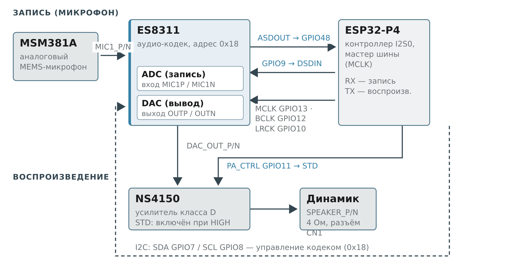

# Аудиотракт Guition JC1060P470C (I_W / I_Y): микрофон, кодек ES8311, усилитель NS4150

Техническое описание аудиоподсистемы платы Guition JC1060P470C на модуле JC-ESP32P4-M3 (ESP32-P4 + ESP32-C6). Документ составлен по принципиальной схеме `JC1060P470C_I_W_Y-V1.0.pdf`, вендорскому BSP (`espressif__esp32_p4_function_ev_board` из демо `esp_brookesia_phone`) и подтверждён работой на железе. Схема аудиотракта: `audio_diagram.png`.

## 1. Общие сведения

Аудиоподсистема платы построена по архитектуре **«один кодек на всё»**: ES8311 обслуживает и запись (АЦП микрофона), и воспроизведение (ЦАП на усилитель). Отдельного контроллера микрофона ES7210 на плате **нет** — на схеме встречается сеть с именем `ES7210_SDOUT`, но это унаследованное имя из референс-дизайна ESP32-P4-Function-EV-Board; физически к ней подключен выход `ASDOUT` самой ES8311 (данные АЦП). Блок `ADC&AEC` на схеме содержит только аналоговый MEMS-микрофон MSM381A с цепями смещения и развязки.

Такая архитектура означает, что в прошивке кодек должен инициализироваться в дуплексном режиме (ADC + DAC одновременно) на одной шине I2S0, а контроллер ESP32-P4 выступает мастером и формирует MCLK.

## 2. Архитектура аудиотракта



### 2.1 Микрофонный тракт (запись)

1. **Микрофон MSM381A** — аналоговый MEMS-микрофон (топ-порт, всенаправленный). Питание микрофона подаётся с цепи `ADC_MICBIAS12` (смещение формируется кодеком), выход — через разделительные конденсаторы 0.1 мкФ (C8/C9) и резистор 0R.
2. **Вход ES8311** — дифференциальные аналоговые входы `MIC1P` / `MIC1N` (сеть `ADC_MIC1_P` / `ADC_MIC1_N`). Внутри кодека сигнал проходит АЦП.
3. **Выход АЦП `ASDOUT`** — последовательные данные микрофона уходят по I2S на контроллер: сеть `ES7210_SDOUT` → **GPIO48** контроллера P4.

### 2.2 Тракт воспроизведения

1. **I2S TX контроллера** — цифровые аудиоданные уходят с **GPIO9** (`CODEC_I2S0_DSDIN`) на вход `DSDIN` кодека.
2. **ЦАП ES8311** — аналоговый стереовыход `OUTP` / `OUTN` (сеть `DAC_OUT_P` / `DAC_OUT_N`), согласованный через RC-цепочку (R8/R15 22K, C4/C7 104/25V).
3. **Усилитель NS4150** — монофонический усилитель класса D. Входы `PA_INL+` / `PA_INL-` принимают сигнал с ЦАП, выход `VO+` / `VO-` → `SPEAKER_P` / `SPEAKER_N` на разъём динамика CN1 (4 Ом).
4. **Управление питанием усилителя** — вход `STD` (shutdown, активен в рабочем режиме при HIGH) управляется с **GPIO11** (сеть `PA_CTRL`), с подтяжкой R19 10K к земле: по умолчанию усилитель выключен, ПО обязано активно подать HIGH.

### 2.3 Тактирование и управление

- **I2S-шина**: P4 — мастер, формирует `MCLK` = GPIO13, `BCLK` (`SCLK`) = GPIO12, `LRCK` (`WS`) = GPIO10. Кодек работает в slave-режиме (`master_mode = false`), использование MCLK обязательно (`use_mclk = true`).
- **Шина управления I2C**: `SDA` = GPIO7, `SCL` = GPIO8 (сеть `ES_I2C_*`), кодек по адресу **0x18** (`ES8311_CODEC_DEFAULT_ADDR`, вывод CE = LOW). Шина общая: на ней же висят тачскрин GT911 (0x5D / 0x14) и RTC RX8130 (0x32).

## 3. Кодек ES8311 и усилитель NS4150

### ES8311

ES8311 — маломощный стерео аудиокодек (24 бита, до 96 кГц) с I2S/PCM-интерфейсом и I2C-управлением. На этой плате используется симметрично: АЦП оцифровывает аналоговый микрофон, ЦАП питает усилитель. В терминах `esp_codec_dev` кодек инициализируется в режиме `ESP_CODEC_DEV_WORK_MODE_BOTH` с `digital_mic = false` (вход аналоговый) и `pa_pin` для управления усилителем средствами драйвера. Аппаратное усиление: `pa_voltage = 5.0`, `codec_dac_voltage = 3.3`.

### NS4150

NS4150 — монофонический усилитель класса D с дифференциальным входом, питание от `VOUT-BAT` (батарея, ~3.7–4.2 В). Вывод `STD` — вход управления: LOW = спящий режим (усилитель отключён), HIGH = рабочий. Резистор R19 10K подтягивает `STD` к земле, поэтому включение звука всегда требует явной подачи HIGH на GPIO11. Типовая выходная мощность — до ~3 Вт на нагрузку 4 Ом при питании 5 В; от батареи реально меньше, громкость следует калибровать программно (регистр громкости ES8311 / `esp_codec_dev_set_out_vol`).

## 4. Карта пинов

| GPIO | Сеть на схеме | Направление | Назначение |
|------|---------------|-------------|------------|
| 13 | `CODEC_I2S0_MCLK` | P4 → кодек | Мастер-такт I2S (для ES8311 обязателен) |
| 12 | `CODEC_I2S0_SCLK` | P4 → кодек | Битовый такт BCLK |
| 10 | `CODEC_I2S0_LRCK` | P4 → кодек | Синхронизация каналов WS/LRCK |
| 9 | `CODEC_I2S0_DSDIN` | P4 → кодек | Данные ЦАП (воспроизведение) |
| **48** | `ES7210_SDOUT` (= ES8311 `ASDOUT`) | **кодек → P4** | **Данные АЦП (микрофон/запись)** |
| **11** | `PA_CTRL` | **P4 → усилитель** | **Включение NS4150 (STD, активный HIGH, R19 10K pull-down)** |
| 7 | `ES_I2C_SDA` | двунапр. | I2C-данные (ES8311 0x18, GT911, RX8130) |
| 8 | `ES_I2C_SCL` | двунапр. | I2C-такт |
| 21 | `TOUCH_INT` | тач → P4 | Прерывание GT911 (та же I2C-шина) |
| 22 | `TOUCH_RST` | P4 → тач | Сброс GT911 |
| 35 | `BOOTMODE`/GPIO35 | вход | Кнопка BOOT |

⚠️ Имена сетей на схеме — не истина в последней инстанции: `ES7210_SDOUT` физически является выходом `ASDOUT` ES8311. Ориентируйтесь на направление сигнала и принадлежность выводу чипа, а не на название цепи.

## 5. Программная конфигурация

### xiaozhi-esp32 (ветка `feature/guition-jc1060p470`)

```c
// main/boards/guition-jc1060p470/config.h
#define AUDIO_INPUT_SAMPLE_RATE  24000
#define AUDIO_OUTPUT_SAMPLE_RATE 24000
#define AUDIO_I2S_GPIO_MCLK GPIO_NUM_13
#define AUDIO_I2S_GPIO_WS   GPIO_NUM_10
#define AUDIO_I2S_GPIO_BCLK GPIO_NUM_12
#define AUDIO_I2S_GPIO_DOUT GPIO_NUM_9
#define AUDIO_I2S_GPIO_DIN  GPIO_NUM_48   // ES8311 ASDOUT (микрофон)
#define AUDIO_CODEC_PA_PIN  GPIO_NUM_11   // PA_CTRL -> STD NS4150
#define AUDIO_CODEC_I2C_SDA_PIN GPIO_NUM_7
#define AUDIO_CODEC_I2C_SCL_PIN GPIO_NUM_8
#define AUDIO_CODEC_I2C_PORT    I2C_NUM_0
#define AUDIO_CODEC_ES8311_ADDR ES8311_CODEC_DEFAULT_ADDR
```

Класс `Es8311AudioCodec` (`main/audio/codecs/es8311_audio_codec.cc`) создаёт дуплексные каналы I2S (TX+RX) и инициализирует кодек в `ESP_CODEC_DEV_WORK_MODE_BOTH`, то есть одновременно и запись, и воспроизведение — именно то, что требуется при архитектуре «один кодек на всё».

> **Важно (история фикса):** в ранней версии конфига пины были перепутаны — `DIN = GPIO11` (это линия PA!) и `PA = GPIO20` (ни к чему не подключён). В результате I2S читал линию включения усилителя (постоянный ноль из-за pull-down) — «микрофон» писал тишину, wake word не срабатывал, а усилитель оставался выключенным. Исправлено коммитом `27c5474` («guition-jc1060p470: fix mic DIN and PA pins per board schematic»). Не откатывайте эти значения без сверки со схемой.

### Вендорский BSP (демо `esp_brookesia_phone`)

В адаптированном компоненте `espressif__esp32_p4_function_ev_board` аудио поднимается двумя вызовами `esp_codec_dev`: `bsp_audio_codec_speaker_init()` (вывод) и `bsp_audio_codec_microphone_init()` (запись). Оба используют один и тот же ES8311 по адресу `ES8311_CODEC_DEFAULT_ADDR`; для записи — `ESP_CODEC_DEV_WORK_MODE_BOTH`, `use_mclk = true`, `digital_mic = false`, PA = `BSP_POWER_AMP_IO` = GPIO11, DSIN = `BSP_I2S_DSIN` = GPIO48.

## 6. Диагностика

| Симптом | Вероятная причина | Как проверить |
|---------|-------------------|---------------|
| Микрофон пишет тишину: wake word не срабатывает, ASR в чате не распознаёт речь | `AUDIO_I2S_GPIO_DIN` не на GPIO48 (например, чтение линии PA) | Сверить config.h со схемой; подать громкий звук и смотреть уровень входа в логе AFE |
| Нет звука из динамика, но кодек инициализирован | GPIO11 (PA_CTRL) не переведён в HIGH — усилитель в shutdown | Измерить уровень GPIO11; проверить, что `pa_pin` передан в конфиг кодека |
| Искажённый/тихий звук | Громкость в регистре ES8311 = 0 после mute; питание NS4150 от батареи просело | `esp_codec_dev_set_out_vol`; напряжение `VOUT-BAT` |
| ES8311 не отвечает на I2C | Ошибка подтяжек или конфликт адресов на общей шине | I2C-скан: должны отвечать 0x18 (ES8311), 0x5D/0x14 (GT911), 0x32 (RTC RX8130) |
| Запись есть, но с сильным шумом | Проблема MICBIAS/земли, микрофон не дифференциально подключен | Осмотр цепей ADC_MIC1_P/N (C8/C9, R14) |

Практический ориентир: если после старта прошивки в логе присутствует I2C-скан, и устройство 0x18 отвечает, а звука/записи нет — причина почти всегда в пинах I2S DIN или PA, а не в кодеке.

## 7. Источники

1. Принципиальная схема `JC1060P470C_I_W_Y-V1.0.pdf` — вендорский пакет `guitionofficial/P4-series`, каталог `5-Schematic`.
2. BSP `espressif__esp32_p4_function_ev_board` — репозиторий [megavatt05/ESP32P4-JC1060P470C-I_W_Y](https://github.com/megavatt05/ESP32P4-JC1060P470C-I_W_Y), ветка `esp_brookesia_phone` (аудио подтверждено на железе).
3. Вендорские демо `Demo_IDF/ESP-IDF` из пакета `guitionofficial/P4-series`.
4. Порт xiaozhi-esp32: [megavatt05/xiaozhi-esp32](https://github.com/megavatt05/xiaozhi-esp32), ветка `feature/guition-jc1060p470`, коммиты `83684b2` (GT911 touch init), `27c5474` (фикс пинов микрофона и PA).
